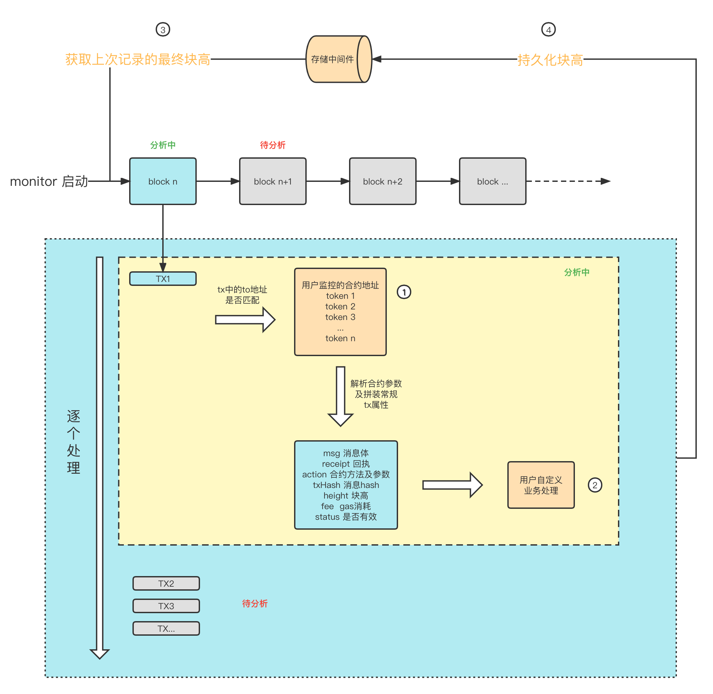

# eth monitor [一闪一闪亮晶晶，star一下好心情]
[](https://goreportcard.com/report/github.com/Rennbon/ethmonitor)


- ETH 多智能合约监控框架，针对智能合约监听做了统一封装，提供handle支持业务实现个性化操作。

# 特性
- 支持自定义业务handle
- 支持多合约监听

# 概念图


- 其中①②③④为用户实现接口需要处理的点
1. 判断tx中的to地址是否是需要监听的合约地址
2. 针对符合条件的tx做业务处理，这里已将tx是否成交,gas消耗，合约参数等常规属性已解析完毕，另外也暴露了msg和receipt供业务自行解析
3. monitor服务启动时会加载，目标是服务后续重启能续航
4. 单个block的内含的tx全部分析完毕后会触发，用户可以自行实现接口选择将数据如何持久化
# 使用介绍

```golang
// 实现TxHandler
var _ ethmonitor.TxHandler = &Mock{}

type Mock struct {
}

type Mock struct {
}

// 持久化块高
func (m *Mock) SaveHeight(ctx context.Context, height *ethmonitor.BlockHeight) error {
	// 保存扫过的块高到自己喜欢的中间件
	return nil
}

// 启动monitor时始化监听块高
func (m *Mock) LoadLastHeight(ctx context.Context) (*ethmonitor.BlockHeight, error) {
	// 从自己喜欢的中间件获取块高
	return big.NewInt(1), nil
}

// 具体业务处理
func (m *Mock) Do(ctx context.Context, info *ethmonitor.TxInfo) {
	
}

// 是否包含需要监控的合约地址
// NOTE: 如果是多智能合约监听，可以使用map维护多个
// 配套的，需要把这些合约的abi合并后再初始化monitor时赋值给AbiStr，注意去重
func (m *Mock) ContainContact(ctx context.Context, address ethmonitor.ContractAddress) bool {
	return true
}

func main() {
	opt := &ethmonitor.Options{
		RpcUrl: "http://localhost:8545",
		AbiStr: `
[
	{ "type" : "function", "name" : ""},
        {"internalType":"string","name":"symbol_","type":"string"}
	{ "type" : "function", "name" : "overloadedNames", "stateMutability" : "view", "inputs": [ { "components": [ { "internalType": "uint256", "name": "_f",	"type": "uint256" }, { "internalType": "uint256", "name": "__f", "type": "uint256"}, { "internalType": "uint256", "name": "f", "type": "uint256"}],"internalType": "struct Overloader.F", "name": "f","type": "tuple"}]}
]`,
		Handler: &Mock{},
	}
	monitor, err := ethmonitor.New(opt)
	if err != nil {
		panic(err)
	}
	monitor.Run()
}

```
## 合约相关操作
```golang
// Action 智能合约的方法
type Action struct {
	Method string                 // 合约方法
	Inputs map[string]interface{} // 合约入参及对应的value
}

// 如何解析智能合约对应参数的value
// 对应abi方法为: { "type" : "function", "name" : "send", "inputs" : [ { "name" : "amount", "type" : "uint256" } ] }
// 我们监控所得实体如下，可以通过反射获得
var act = &Action{
	Method : "send"
	Inputs : map[string]interface{}{"amount": big.NewInt(250)}
}

amount,ok := act.Inputs["amount"].(*big.Int)

if ok {
    fmt.Println(amount.String())
}
```
